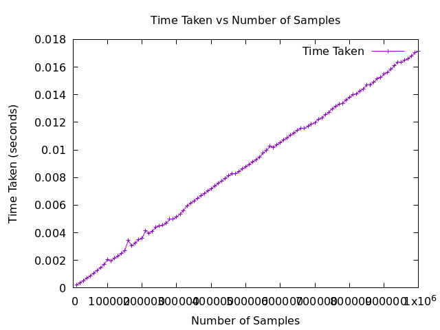
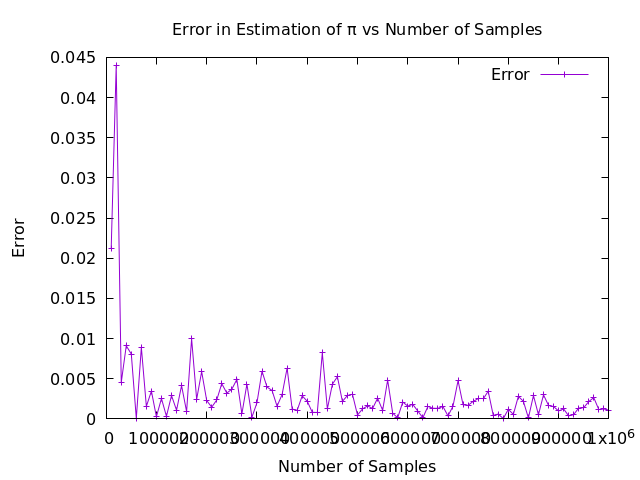
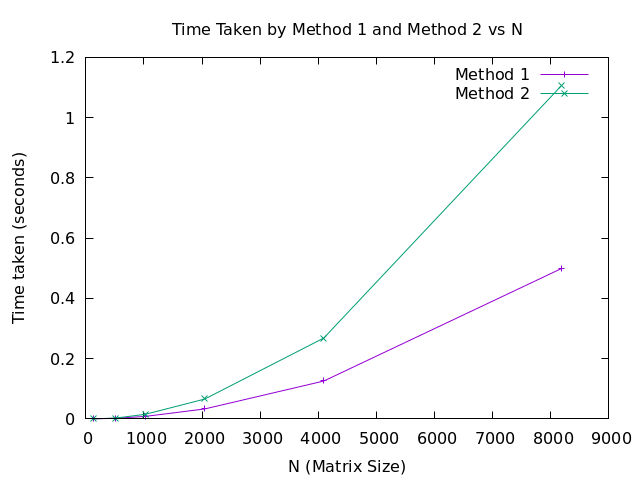
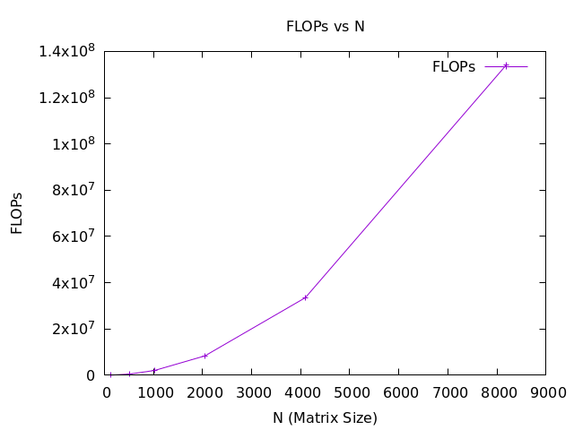

# CS3811 - High Performance Computing and Big Data Lab

# Lab 1

> Name: M K Lokesh Kumar

> Registration No.: 2201113026

> Class: Cyber Security(Semester 5)

---
---

## Experiment 1

### Objective
To estimate the value of π using a randomised algorithm technique(Monte Carlo), and plot 2 performance graphs:
- Graph 1 - Time taken by the code vs Number of samples
- Graph 2 - Error vs number of samples

### Code

Written in C++.

```cpp
#include <iostream>
#include <cstdlib>
#include <ctime>
#include <cmath>
#include <chrono>
#include <vector>

double estimatePi(int numSamples) {
    int pointsInsideCircle = 0;

    for (int i = 0; i < numSamples; i++) {
        double x = static_cast<double>(rand()) / RAND_MAX;
        double y = static_cast<double>(rand()) / RAND_MAX;

        if (x * x + y * y <= 1) {
            pointsInsideCircle++;
        }
    }

    return 4.0 * pointsInsideCircle / numSamples;
}

int main() {
    srand(static_cast<unsigned int>(time(0)));
    const int maxSamples = 1000000;
    const int step = 10000;

    std::vector<int> sampleSizes;
    std::vector<double> times;
    std::vector<double> errors;
    std::vector<double> pi;

    for (int numSamples = step; numSamples <= maxSamples; numSamples += step) {
        auto start = std::chrono::high_resolution_clock::now();
        double piEstimate = estimatePi(numSamples);
        auto end = std::chrono::high_resolution_clock::now();

        std::chrono::duration<double> duration = end - start;
        double timeTaken = duration.count();
        double error = std::abs(M_PI - piEstimate);

        sampleSizes.push_back(numSamples);
        times.push_back(timeTaken);
        errors.push_back(error);
        pi.push_back(piEstimate);
    }

    std::cout << "Samples\tTime\tError\tPi Estimate" << std::endl;
    for (size_t i = 0; i < sampleSizes.size(); ++i) {
        std::cout << sampleSizes[i] << "\t" << times[i] << "\t" << errors[i] << "\t" << pi[i] << std::endl;
    }

    return 0;
}

```

Gnuplot script for plotting performance graphs 1 and 2

```gnuplot

set terminal pngcairo enhanced font 'Verdana,12'

set output 'ex_1_time_vs_samples.png'
set title 'Time Taken vs Number of Samples'
set xlabel 'Number of Samples'
set ylabel 'Time Taken (seconds)'
plot 'data1.dat' using 1:2 with linespoints title 'Time Taken'

set output 'ex_1_error_vs_samples.png'
set title 'Error in Estimation of π vs Number of Samples'
set xlabel 'Number of Samples'
set ylabel 'Error'
plot 'data1.dat' using 1:3 with linespoints title 'Error'

```

### Output 


### Performance Graphs

- Time taken by the graph vs Number of samples



- Error vs Number of samples



---

# Experiment 2

### Objective
Write a C/C++ program to perform matrix-vector multiplication using 2 different methods.


Also, plot 2 performance graphs:
- Graph 1 - Time taken by Method 1 and Method 2 vs N
- Graph 2 - FLOPs vs N

### Code

Writen in C++.

```cpp

#include <iostream>
#include <vector>
#include <chrono>

void method1(const std::vector<std::vector<double>>& A, const std::vector<double>& x, std::vector<double>& b) {
    int N = A.size();
    for (int i = 0; i < N; i++) {
        b[i] = 0;
        for (int j = 0; j < N; j++) {
            b[i] += A[i][j] * x[j];
        }
    }
}

void method2(const std::vector<std::vector<double>>& A, const std::vector<double>& x, std::vector<double>& b) {
    int N = A.size();
    for (int i = 0; i < N; i++) {
        b[i] = 0;
        for (int j = 0; j < N; j++) {
            b[i] += A[j][i] * x[i];
        }
    }
}

int main() {
    const std::vector<int> sizes = {128, 512, 1024, 2048, 4096, 8192};

    std::cout << "N" << "\t" << "Time taken by method 1" << "\t" << "Time taken by method 2" << "\t" << "FLOPs" << std::endl;

    for (int N : sizes) {
        std::vector<std::vector<double>> A(N, std::vector<double>(N));
        std::vector<double> x(N);
        std::vector<double> b1(N, 0);
        std::vector<double> b2(N, 0);

        for (int i = 0; i < N; i++) {
            for (int j = 0; j < N; j++) {
                A[i][j] = static_cast<double>(rand()) / RAND_MAX;
            }
            x[i] = static_cast<double>(rand()) / RAND_MAX;
        }

        auto start1 = std::chrono::high_resolution_clock::now();
        method1(A, x, b1);
        auto end1 = std::chrono::high_resolution_clock::now();
        std::chrono::duration<double> duration1 = end1 - start1;
        double timeMethod1 = duration1.count();

        auto start2 = std::chrono::high_resolution_clock::now();
        method2(A, x, b2);
        auto end2 = std::chrono::high_resolution_clock::now();
        std::chrono::duration<double> duration2 = end2 - start2;
        double timeMethod2 = duration2.count();

        double flops = 2.0 * N * N;

        std::cout << N << "\t" << timeMethod1 << "\t" << timeMethod2 << "\t" << flops << std::endl;
    }

    return 0;
}

```

Gnuplot script for plotting performance graphs 1 and 2

```gnuplot

set terminal pngcairo enhanced font 'Verdana,12'

set output 'ex_2_time_vs_N.png'
set title 'Time Taken by Method 1 and Method 2 vs N'
set xlabel 'N (Matrix Size)'
set ylabel 'Time taken (seconds)'
plot 'data2.dat' using 1:2 with linespoints title 'Method 1', \
     'data2.dat' using 1:3 with linespoints title 'Method 2'

set output 'ex_2_flops_vs_N.png'
set title 'FLOPs vs N'
set xlabel 'N (Matrix Size)'
set ylabel 'FLOPs'
plot 'data2.dat' using 1:4 with linespoints title 'FLOPs'

```

### Output


### Performance Graphs

- Graph 1 - Time taken by Method 1 and Method 2 vs N



- Graph 2 - FLOPs vs N


