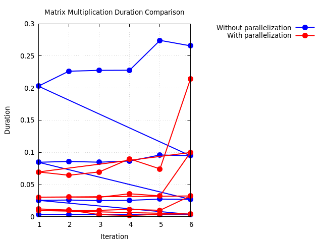

# CS3811 - High Performance Computing and Big Data Lab

# Lab 2

> Name: M K Lokesh Kumar

> Registration No.: 2201113026

> Class: Cyber Security(Semester 5)

---
---

## Experiment 1

### Objective
Write a C/C++ to find the optimal matrix multiplication ordering.

### Code

Written in C++.

```cpp
#include <iostream>
#include <chrono>
#include <cstdlib>
#include <fstream>
#include <omp.h>
#include <map>
#include <vector>

using namespace std;
using namespace std::chrono;

int** gen_matrix(int size) {
    int** temp = new int*[size];
    for (int i = 0; i < size; i++){
        temp[i] = new int[size];
        for (int j = 0; j < size; j++) {
            temp[i][j] = 1;
        }
    }

    return temp;
}

void free_matrix(int** mat, int size) {
    for (int i = 0; i < size; i++) {
        delete[] mat[i];
    }
    delete[] mat;
}

double matrix_multiply(int** A, int** B, int** C, int matrix_size, int stat) {
    auto start = high_resolution_clock::now();

    for (int i = 0; i < matrix_size; i++) {
        for (int j = 0; j < matrix_size; j++) {
            C[i][j] = 0;
            for (int k = 0; k < matrix_size; k++) {
                switch(stat) {
                    case 1:
                    C[i][j] += A[i][k] * B[k][j];
                    break;

                    case 2:
                    C[i][k] += A[i][j] * B[j][k];
                    break;

                    case 3:
                    C[j][i] += A[j][k] * B[k][i];
                    break;

                    case 4:
                    C[j][k] += A[j][i] * B[i][k];
                    break;

                    case 5:
                    C[k][i] += A[k][j] * B[j][i];
                    break;

                    case 6:
                    C[k][j] += A[k][i] * B[i][j];
                    break;

                    default:
                    cout << "Invalid option" << endl;
                }
            }
        }
    }

    auto stop = high_resolution_clock::now();

    duration<double> duration = stop - start;

    return duration.count();
}

int main() {
    // Serial code
    map<int, vector<double>> iteration_durations;
    int iteration, matrix_size;
    double duration;

    ofstream outfile1("data_1_0.dat");
    outfile1 << "Iteration" << "\t" << "Matrix Size" << "\t" << "Duration" << endl;

    for (int size = 100; size <= 400; size += 100) {
        int** A = gen_matrix(size);
        int** B = gen_matrix(size);
        int** C = new int*[size];
        for (int i = 0; i < size; i++) {
            C[i] = new int[size];
        }
        for (int i = 1; i <= 6; i++) {
            double time = matrix_multiply(A, B, C, size, i);
            outfile1 << i << "\t\t\t" << size << "\t\t\t" << time << endl;
            iteration_durations[i].push_back(time);
        }

        free_matrix(A, size);
        free_matrix(B, size);
        free_matrix(C, size);
    }
    outfile1.close(); 

    ofstream outfile2("data_1_1.dat");
    outfile2 << "Iteration" << "\t" << "Average Duration" << endl;

    for (const auto& entry: iteration_durations) {
        int iter = entry.first;
        const vector<double>& durations = entry.second;

        double sum = 0.0;
        for (double d: durations) {
            sum += d;
        }
        double average = sum / durations.size();
        outfile2 << iter << "\t\t\t" << average << endl;
    }
    outfile2.close();

    return 0;
}

```

### Output 


---

# Experiment 2

### Objective
Write a C/C++ program to perform matrix-vector multiplication using parallelization.

### Code

Writen in C++.

```cpp
#include <iostream>
#include <chrono>
#include <cstdlib>
#include <fstream>
#include <omp.h>
#include <map>
#include <vector>

using namespace std;
using namespace std::chrono;

int** gen_matrix(int size) {
    int** temp = new int*[size];
    for (int i = 0; i < size; i++){
        temp[i] = new int[size];
        for (int j = 0; j < size; j++) {
            temp[i][j] = 1;
        }
    }

    return temp;
}

void free_matrix(int** mat, int size) {
    for (int i = 0; i < size; i++) {
        delete[] mat[i];
    }
    delete[] mat;
}

double matrix_multiply(int** A, int** B, int** C, int matrix_size, int stat) {
    auto start = high_resolution_clock::now();

    #pragma omp parallel for
    for (int i = 0; i < matrix_size; i++) {

        #pragma omp parallel for
        for (int j = 0; j < matrix_size; j++) {
            C[i][j] = 0;

            #pragma omp parallel for
            for (int k = 0; k < matrix_size; k++) {
                switch(stat) {
                    case 1:
                    C[i][j] += A[i][k] * B[k][j];
                    break;

                    case 2:
                    C[i][k] += A[i][j] * B[j][k];
                    break;

                    case 3:
                    C[j][i] += A[j][k] * B[k][i];
                    break;

                    case 4:
                    C[j][k] += A[j][i] * B[i][k];
                    break;

                    case 5:
                    C[k][i] += A[k][j] * B[j][i];
                    break;

                    case 6:
                    C[k][j] += A[k][i] * B[i][j];
                    break;

                    default:
                    cout << "Invalid option" << endl;
                }
            }
        }
    }

    auto stop = high_resolution_clock::now();

    duration<double> duration = stop - start;

    return duration.count();
}

int main() {
    // Serial code
    map<int, vector<double>> iteration_durations;
    int iteration, matrix_size;
    double duration;
    
    ofstream outfile1("data_2_0.dat");
    outfile1 << "Iteration" << "\t" << "Matrix Size" << "\t" << "Duration" << endl;


    for (int size = 100; size <= 400; size += 100) {
        int** A = gen_matrix(size);
        int** B = gen_matrix(size);
        int** C = new int*[size];
        for (int i = 0; i < size; i++) {
            C[i] = new int[size];
        }
        for (int i = 1; i <= 6; i++) {
            double time = matrix_multiply(A, B, C, size, i);
            outfile1 << i << "\t\t\t" << size << "\t\t\t" << time << endl;
            iteration_durations[i].push_back(time);
        }

        free_matrix(A, size);
        free_matrix(B, size);
        free_matrix(C, size);
    }
    outfile1.close(); 

    ofstream outfile2("data_2_1.dat");
    outfile2 << "Iteration" << "\t" << "Average Duration" << endl;

    for (const auto& entry: iteration_durations) {
        int iter = entry.first;
        const vector<double>& durations = entry.second;

        double sum = 0.0;
        for (double d: durations) {
            sum += d;
        }
        double average = sum / durations.size();
        outfile2 << iter << "\t\t\t" << average << endl;
    }
    outfile2.close();

    return 0;
}

```

---

### Output


Gnuplot script for plotting performance graphs 1 and 2

```gnuplot

set terminal pngcairo enhanced font 'Verdana,10'
set output 'ex_1_vs_2_plot.png'

set title "Matrix Multiplication Duration Comparison"
set xlabel "Iteration"
set ylabel "Duration"

set grid

set key outside

set style line 1 lt 1 lw 2 pt 7 ps 1.5 lc rgb "blue"
set style line 2 lt 1 lw 2 pt 7 ps 1.5 lc rgb "red"

plot 'data_1_0.dat' using 1:3 with linespoints linestyle 1 title 'Without parallelization', \
'data_2_0.dat' using 1:3 with linespoints linestyle 2 title 'With parallelization'

```

### Performance Graphs

- Graph 1 - Time taken vs Iteration without and with parallelisation

