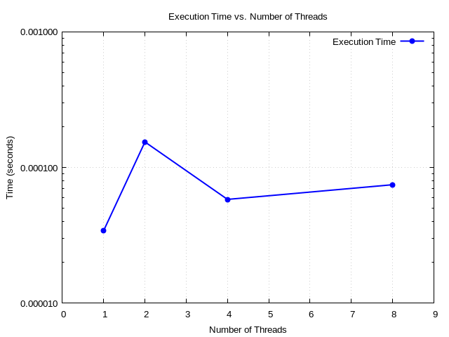

# CS3811 - High Performance Computing and Big Data Lab

# Lab 6

> Name: M K Lokesh Kumar

> Registration No.: 2201113026

> Class: Cyber Security(Semester 5)

---
---

## Experiment 1

### Objective
To perform sparse matrix computations and plot a performance graph comparing the execution time against the number of processing elements used for parallelization.

### Code

Written in C++.

> The matrix used here was downloaded from the Matrix Market, and has 1138 rows, 1138 columns, and 2596 non-zero values in it. It can be found here: [Link to Matrix](https://sparse.tamu.edu/HB/1138_bus)

```cpp
#include <iostream>
#include <vector>
#include <fstream>
#include <omp.h>
#include <chrono>

using namespace std;

struct CSRMatrix {
    int rows, cols;
    vector<int> row_ptr, col_idx;
    vector<double> vals;
};

CSRMatrix read_mtx(const string &filename) {
    ifstream infile(filename);
    
    CSRMatrix matrix;
    int nz;
    infile >> matrix.rows >> matrix.cols >> nz;

    matrix.row_ptr.resize(matrix.rows + 1);
    matrix.col_idx.resize(nz);
    matrix.vals.resize(nz);

    int row, col;
    double val;

    vector<int> row_count(matrix.rows + 1, 0);

    for (int i = 0; i < nz; i++) {
        infile >> row >> col >> val;
        row--;
        col--;
        matrix.col_idx[i] = col;
        matrix.vals[i] = val;
        row_count[row + 1]++;
    }

    for (int i = 1; i <= matrix.rows; i++) {
        matrix.row_ptr[i] = matrix.row_ptr[i - 1] + row_count[i];
    }

    return matrix;
}

void spmv(const CSRMatrix &matrix, const vector<double> &v, vector<double> &res, int threads) {
    #pragma omp parallel for num_threads(threads)
    for (int i = 0; i < matrix.rows; i++) {
        double sum = 0.0;
        for (int j = matrix.row_ptr[i]; j < matrix.row_ptr[i + 1]; j++) {
            sum += matrix.vals[j] * v[matrix.col_idx[j]];
        }
        res[i] = sum;
    }
}

int main() {
    ofstream outfile("data_1_0.dat");
    outfile << "Num of threads" << "\t" << "Time in seconds" << endl; 

    CSRMatrix matrix = read_mtx("1138_bus.mtx");

    vector<double> v(matrix.cols, 1.0);
    vector<double> res(matrix.rows, 0.0);

    vector<int> numThreads = {1, 2, 4, 8};

    for (int i = 0; i < numThreads.size(); i++) {
        double start = omp_get_wtime();
    spmv(matrix, v, res, numThreads[i]);
    double duration = omp_get_wtime() - start;
    outfile << numThreads[i] << "\t" << duration << endl;
    }

    return 0;
}
```

Gnuplot script for plotting performance graph

```gnuplot

set terminal pngcairo enhanced font 'Arial,10'
set output 'spmv_plot_1_0.png'

set title "Execution Time vs. Number of Threads"
set xlabel "Number of Threads"
set ylabel "Time (seconds)"
set grid

set logscale y 10
set xrange [0:9]

plot "data_1_0.dat" using 1:2 with linespoints \
     title "Execution Time" lw 2 pt 7 lc rgb "blue"


```

### Output 


### Performance Graphs

- Execution time vs Number of processing elements

